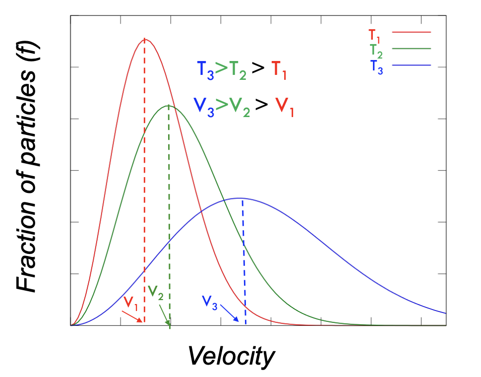
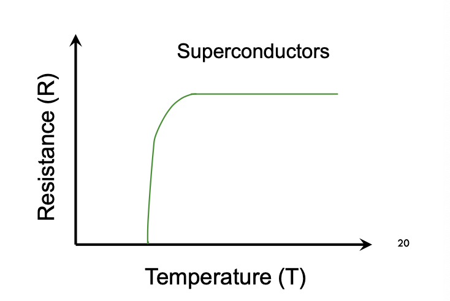
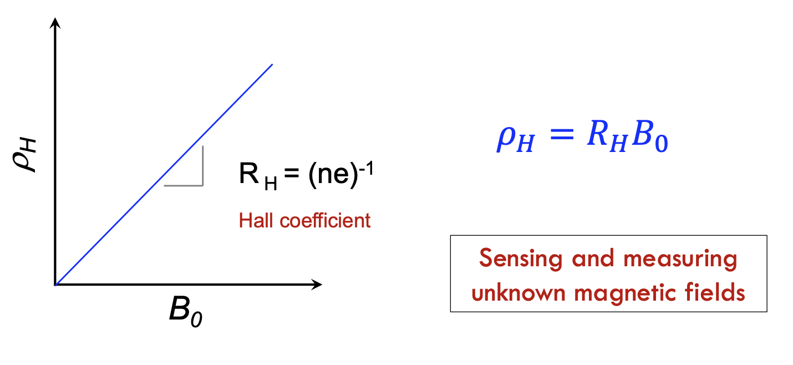

# Physics of Materials

## Outline

- [Module 1](#module-1)
  - [Kinetic Theory of Gases](###kinetic-theory-of-gases)
  - [Velocity Distribution in an Ideal Gas](###velocity-distribution-in-an-ideal-gas)
  - [Energy of an Ideal Gas](###energy-of-an-ideal-gas)
  - [Electrical Properties of Materials](###electrical-properties-of-materials)
  - [Drude's model for electrical conductivity](###drudes-model-for-electrical-conductivity)
  - [Hall Effect](###hall-effect)
  - [Drude's Model and Mean Free Path](###drudes-model-and-mean-free-path)
  - [Drude's model limitations](###drudes-model-limitations)
  - [Thermal Conductivity](###thermal-conductivity)
  - [Wiedmann-Franz Law](###wiedmann-franz-law)
  - [Drude's model for 1-D thermal conductivity](###drudes-model-for-1-d-thermal-conductivity)
- [Module 2](#module-2)

## Module 1

> If, in some cataclysm, all of scientific knowledge were to be destroyed, and only one sentence is passed on the nex generations of creatures, what statement would contain the most information in the fewest words? 
>
> *I belive it is the atomic hypothesis what all thigns are made of atoms - little particles that move around in perpetual motion, attracting each other when they are a little distance apart, but repelling upon being squeezed into one another. In that setence, you will see, there is an enormous amount of information about the world, if just a little imagination and thinking are applied.*
> Richard Feynman 

### Kinetic Theory of Gases

#### Assumptions: 

- Very large number of neutral atoms
- Atoms are hard spheres
  - Elasstic collisions
  - Average change in momentum is 0
- Gas atoms have 'no' volume

### Velocity distribution in an Ideal Gas

Fraction of particles (f) = $\frac{dN}{N}$

where, N is the total number of particles and dN is the particles with velocity v and v + dv

### Energy of an Ideal Gas

- The number of degrees of freedom (DOF) can be defined as the minimum number of independent coordinates, which can specify the configuration of the system. For example, a single particles in space requires three coordinates so it has three degrees of freedom.
- **The equipartition theorem** relates the temperature of a system with its average energies. At temperature T, the average energy of any **quadratic degree of freedom** is 1/2 kBT

For, N atoms total energy = $\frac{3NkBT}{2}$ (for 3 degrees of )

Specific heat (CV) of any ideal gas = $\frac{dE}{dT}$ = $\frac{3Nk_B}{2}$ = $\frac{3}{2}R$

### Electrical properties of materials

- Ohm's law: V=IR
- Electric field: E = $\frac{V}{L}$
- Current density: J = $\frac{I}{A}$
- E = $\frac{RA}{L}J$ = $J\rho$

### Drude's model for electrical conductivity

Drude assumed that: 

- In metals, atoms give away valence electrons leaving positive ion cores behind
- Electrons get scattered by the +ve isons with a scattering time of $\tau$ (Approx 10-14 seconds)
- The probablity of collisions, Pcoll = $\frac{dt}{\tau}$
- The electrons are free and do not have any potential energy
- $\frac{dp}{dt}$ = $f(t) - \frac{p(t)}{\tau}$, momentum change when electrons experiencing a electric/magnetic force
  - If no external force, f(t) = 0
- When there is a finite external force (DC electric field of E, f(t) = -eE)
- $\rho = \frac{m}{ne^2\tau}$ (Sometimes called **Drude's resistivity/longitudinal resistivity**) 
- $\sigma = \frac{ne^2\tau}{m}$

### fHall effect

- Ex = $\frac{1}{ne}B_0J_0$ (**Hall's resistivity/transverse resistivity**) and Ey = $\frac{m}{ne^2\tau}J$ 

### Drude's model and mean free path

- If the drift velocity of electrons is v0: $v_0 = \sqrt{\frac{3k_BT}{m}}$

- At 300K, v0 approx 105m/s and for most metals, $\tau$ approx 10-14 to 10-15s

  By definition, mean free path = $\tau v_0$ = 1 A nm to 10 A

### Drude's model limitations

- Assumes electrons as classical particles, and utilizes M-B statistics
- Demostrates that for electrons, v0 proportional to $\sqrt{T}$
- At room temperature, v0 is 105 m/s whereas measurements show 106m/s
- At lower temperature MFP predicted by the model is 10nm

### Thermal conductivity

- **Thermal conductivity** of a material is a measure of its ability to conduct heat

### Wiedmann-Franz law

- $\frac{k}{\sigma} = C_{WF}T$, where k is thermal conductivity, $\sigma$ is electrical conductivity and CWF is Widemann-Franz constant

### Drude's model for 1-D thermal conductivity

- $J_Q = -nv_x^2\tau\frac{dT}{dx}\frac{dE_x}{dT}$
- $J_Q = -k\frac{dT}{dx}, k_x = nv_x^2\tau\frac{dE_x}{dT}$
- $k_x = nv_x^2\tau C_v$
- In a 3-D material, k = $\frac{1}{3}n<v^2>\tau C_v$ 
  - $\frac{k}{\sigma T} = \frac{3}{2}(\frac{k_B}{e})^2$

## Module 2

### Dielectric properties of Materials

